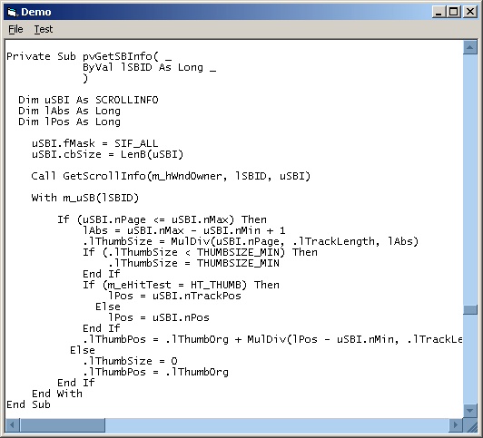



## cCoolScrollbars \(Update: support for 'drop\-down' windows\)

### Description

cCoolScrollbars is a little class which will let you customize (in fact, "overpaint") built-in scrollbars appearance. Two modes: Flat and Custom-Draw. For more information read class' comments and have a look at given URL to know how this SHOULD be achieved. // Need to register SubclassingSink.tlb 

----

Update Dec 14th: Support for 'drop-down' windows. Added basic demo classes: cFlatCombo and cFlatImageCombo.
 
### More Info
 

             |
---                |---
**Submitted On**   |2005-12-14 17:08:58
**By**             |[Carles P\.V\.](https://github.com/Planet-Source-Code/PSCIndex/blob/master/ByAuthor/carles-p-v.md)
**Level**          |Intermediate
**User Rating**    |5.0 (120 globes from 24 users)
**Compatibility**  |VB 6\.0
**Category**       |[Custom Controls/ Forms/  Menus](https://github.com/Planet-Source-Code/PSCIndex/blob/master/ByCategory/custom-controls-forms-menus__1-4.md)
**World**          |[Visual Basic](https://github.com/Planet-Source-Code/PSCIndex/blob/master/ByWorld/visual-basic.md)
**Archive File**   |[cCoolScrol19593312232005\.zip](https://github.com/Planet-Source-Code/carles-p-v-ccoolscrollbars-update-support-for-drop-down-windows__1-63527/archive/master.zip)

